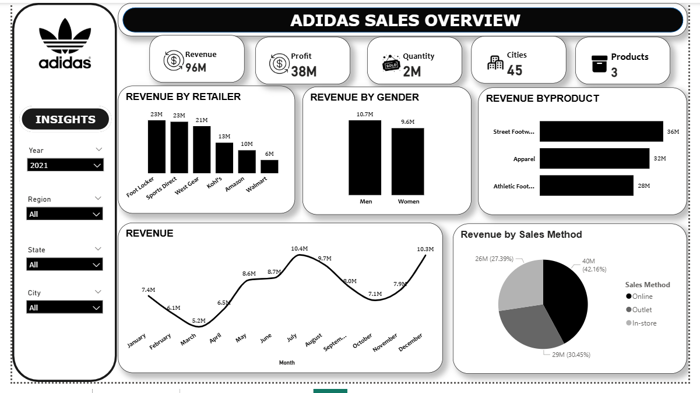
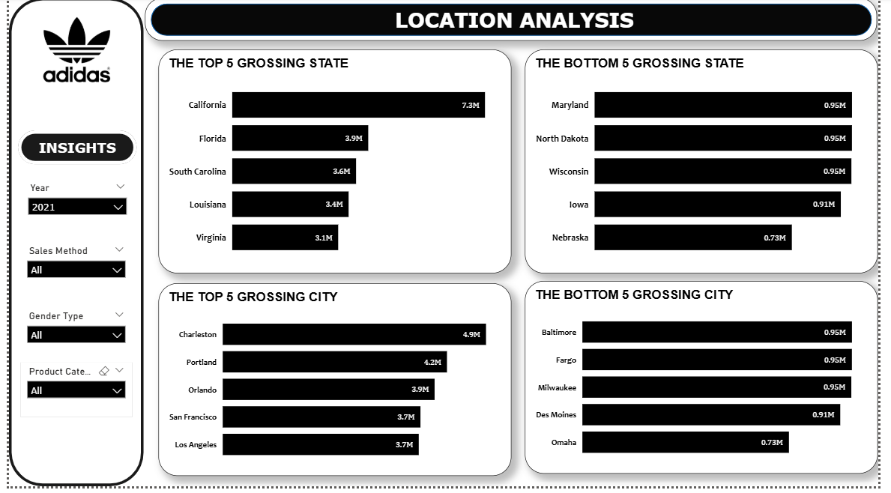

# Retail Sales Analytics Dashboard (Adidas)

## 📌 Project Overview
This project presents an interactive Power BI dashboard built to analyze Adidas retail sales performance across products, customer segments, sales channels, and geographic locations.

It represents one of my early business intelligence projects and focuses on creating a structured sales overview and location-based analysis using Power BI.

## 🎯 Business Objective
The objective of this dashboard is to provide a consolidated view of Adidas sales performance by examining:
- Revenue and profit distribution
- Product and customer segment performance
- Sales channel contribution
- Geographic performance at state and city levels

## 📊 Business Questions Addressed
- How is total revenue and profit distributed across products and retailers?
- Which customer segments contribute the most to revenue?
- What sales channels drive the highest share of revenue?
- Which states and cities are top and bottom performers?
- How does revenue trend over time?

## 🧠 Tools Used
- **Power BI** – Data transformation, data modeling, DAX measures, and dashboard visualization  

## 📂 Dataset
- Source: Public Adidas retail sales dataset  
- Dataset includes:
  - Revenue, profit, and quantity sold
  - Product categories
  - Sales methods (online, outlet, in-store)
  - Customer segments (gender)
  - Geographic attributes (state and city)
  - Monthly time-series data

## 🛠 Methodology
- Imported and transformed raw data directly in Power BI
- Created calculated measures for revenue, profit, and quantity
- Built interactive visuals with slicers for:
  - Year
  - Region
  - State
  - City
- Designed two main dashboard pages:
  - **Sales Overview**
  - **Location Analysis**

## 📈 Key Insights
- Total revenue reached approximately **$120M**, with **2021 contributing about $96M**. This increase was largely driven by geographic expansion from **9 cities in 2020 to 45 cities in 2021**, while the product mix remained unchanged, indicating primarily inorganic growth.
- **Online sales generated the highest share of revenue (~37%)**, although outlet and in-store channels contributed comparable shares. This suggests the need for a cost–benefit evaluation before prioritizing any single sales channel.
- **Male customers accounted for the majority of revenue** across both years, highlighting an opportunity to strengthen the female product segment while maintaining strong engagement with the existing male customer base.
- **Street footwear consistently emerged as the top-performing product category** across both years, indicating strong and stable customer demand for this product line.

## 📊 Dashboard Pages
### 1. Sales Overview
Provides a high-level view of key KPIs, revenue breakdowns by product, retailer, and customer segment, as well as monthly revenue trends.

### 2. Location Analysis
Highlights top and bottom performing states and cities to support geographic performance evaluation.

## 📊 Dashboard Preview

### Sales Overview

### Location Analysis

## 💡 Business Value
This dashboard enables stakeholders to:
- Quickly assess overall retail sales performance
- Identify high- and low-performing regions
- Understand product and channel contribution
- Support high-level sales and expansion discussions

## 📝 Project Note
This dashboard reflects my early work in Power BI. Since completing this project, I have improved my dashboard design, analytical depth, and storytelling approach, and plan to revisit and enhance this analysis in a future iteration.

## 📁 Files Included
- Power BI dashboard file (.pbix)
- Source dataset
- Dashboard screenshots

## 📬 Contact
**Malik Azeez**  
LinkedIn: https://www.linkedin.com/in/malik-azeez  
GitHub: https://github.com/Malikazeez

